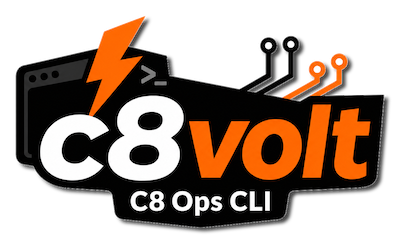

# c8volt Camunda 8 CLI

**Operator-grade Camunda 8 workflow control. Fresh 8.9 support. Script-safe and AI-agent-safe command contracts.**

> **done is done**
>
> If an action needs retries, waiting, tree traversal, state checks, cleanup, or deterministic machine output before it is truly finished, `c8volt` should do that work for you.

`c8volt` is a Camunda 8 CLI for teams that care about outcomes, not just accepted requests. It is built for operators, developers, support engineers, CI pipelines, and AI agents that need a trustworthy way to discover commands, run them non-interactively, and interpret results.

## Fast Start

### 1. Install

Download the appropriate archive from [c8volt Releases](https://github.com/grafvonb/c8volt/releases), unpack it, then verify the binary:

```bash
./c8volt version
```

Each release archive includes a ready-to-edit `config.example.yaml` next to the binary. Copy or edit it into `config.yaml` for your environment.

### 2. Configure

For local Camunda 8 Run or another unsecured development cluster, the smallest useful config is:

```yaml
app:
  camunda_version: "8.9"
apis:
  camunda_api:
    base_url: "http://localhost:8080"
auth:
  mode: none
log:
  level: info
```

For the normal case, set only `apis.camunda_api.base_url`. `c8volt` derives:

- Camunda API as `.../v2`
- Operate API as `.../v1`
- Tasklist API as `.../v1`

Common config locations:

- `./config.yaml`
- `$HOME/.c8volt/config.yaml`
- `$HOME/.config/c8volt/config.yaml`

You can also point to a file explicitly:

```bash
./c8volt --config ./config.yaml config show --validate
```

Useful setup commands:

```bash
./c8volt config show
./c8volt config show --validate
./c8volt config show --template
./c8volt --profile prod config show
```

### 3. Verify Connectivity

```bash
./c8volt get cluster topology
./c8volt get cluster license
```

### 4. Get A Runnable Environment

Deploy bundled BPMN fixtures directly from the binary:

```bash
./c8volt embed list
./c8volt embed deploy --all
./c8volt embed deploy --all --run
```

This is the quickest path from a clean environment to real process instances you can inspect, wait for, cancel, and delete.

## Why c8volt

Many CLIs stop at "request accepted." `c8volt` is shaped around the next questions:

- Did the process instance actually reach `ACTIVE`?
- Where is the incident, and what else is in the same process tree?
- Did the cancellation hit the root that really matters?
- Did deletion remove the whole family, not just one visible node?
- Can a script or agent discover the right command path without parsing help text?
- Can unattended execution fail explicitly instead of hanging on prompts or mixing logs into stdout?

That is the gap `c8volt` closes.

## At A Glance

- deploy BPMN and use it immediately
- run process instances and confirm they are active
- inspect process-instance trees before changing them
- cancel safely, including root escalation with `--force`
- delete process-instance families thoroughly
- wait for the state you actually need
- triage incidents in direct lookups and process-instance walks
- page through large process-instance result sets safely
- return only the numeric process-instance match count with `get pi --total`
- scope commands by profile and tenant when operating shared clusters
- validate config and inspect cluster metadata when setting up or troubleshooting
- discover the public command surface with `capabilities --json`
- run supported commands non-interactively with `--automation`

## Supported Camunda Versions

`c8volt` supports Camunda `8.7`, `8.8`, and `8.9`.

`8.9` is a first-class runtime target with the same practical repository command-family coverage already available on `8.8`, including cluster metadata, process-definition discovery and XML retrieval, resource lifecycle operations, process-instance lifecycle flows, search, waiting, traversal, cancel/delete flows, and tenant-aware runtime behavior.

`8.8` remains the established baseline. `8.7` remains supported with known upstream limitations where tenant-safe direct keyed process-instance behavior is not available.

## Core Workflows

### Start And Confirm

```bash
./c8volt get pd --latest
./c8volt run pi -b C88_SimpleUserTask_Process
```

By default, `c8volt` waits until the process instance is actually active. If you explicitly want asynchronous behavior:

```bash
./c8volt run pi -b C88_SimpleUserTask_Process --no-wait
```

For batch execution:

```bash
./c8volt run pi -b C88_SimpleUserTask_Process -n 100 --workers 8
```

### Walk Before You Change

```bash
./c8volt walk pi --key 2251799813711967 --family
./c8volt walk pi --key 2251799813711967 --family --tree
./c8volt walk pi --key 2251799813711967 --family --with-incidents
```

This is where `c8volt` becomes an operations tool instead of just a resource browser: it helps you see the process-instance structure that explains why a cancellation or deletion may behave the way it does.

For incident diagnosis, add `--with-incidents` to keyed walks to show incident keys and messages under the matching process-instance rows, or combine it with `--json` for structured incident details.

### Cancel Safely

Camunda may reject direct cancellation of a child instance when the real action must happen at the root.

```bash
./c8volt cancel pi --key 2251799813711977
./c8volt cancel pi --key 2251799813711977 --dry-run
./c8volt cancel pi --key 2251799813711977 --force
./c8volt cancel pi --state active --start-date-before 2026-03-31
./c8volt cancel pi --state active --start-date-newer-days 30
```

With `--dry-run`, `c8volt` previews the selected process instances, process-instance trees to cancel, process instances in scope, selected instances already in final state, and any partial-scope details without submitting cancellation. With `--force`, `c8volt` escalates from the selected child to the root process instance and waits for the family-level outcome.

### Delete Thoroughly

```bash
./c8volt delete pi --key 2251799813711967 --dry-run
./c8volt delete pi --key 2251799813711967 --force
./c8volt delete pi --state completed --end-date-after 2026-01-01 --end-date-before 2026-01-31 --auto-confirm
./c8volt get pi --state completed --keys-only | ./c8volt delete pi --auto-confirm -
```

Deletion in real environments often means preview the family scope, cancel-first when needed, then remove, then verify. `--dry-run` shows selected instances already in final state and process instances not in final state. Delete is all-or-nothing for the affected scope: if any selected or dependency-expanded process instance is not in a final state, c8volt refuses the whole delete batch before submitting any delete request. Use `--force` when the affected scope must be canceled first and then deleted.

### Wait For A Known State

```bash
./c8volt expect pi --key <process-instance-key> --state active
./c8volt expect pi --key <process-instance-key> --state completed --state absent
./c8volt expect pi --key <process-instance-key> --state canceled
./c8volt get pi --key <process-instance-key> --keys-only | ./c8volt expect pi --state active -
```

`expect` waits for `active`, `completed`, `canceled`, `terminated`, or `absent`, and works naturally with piped keys for bulk verification flows.

### Search And Page Process Instances

```bash
./c8volt get pi --state active
./c8volt get pi --state active --total
./c8volt get pi --state active --batch-size 250 --limit 25
./c8volt cancel pi --state active --batch-size 250 --limit 25 --dry-run
./c8volt cancel pi --state active --batch-size 250 --limit 25
./c8volt delete pi --state completed --batch-size 250 --limit 25 --dry-run
./c8volt delete pi --state completed --batch-size 250 --limit 25 --auto-confirm
```

Search-based `get pi`, `cancel pi`, and `delete pi` work page by page instead of silently stopping at the first large result set. Human-oriented modes prompt before continuing unless `--auto-confirm` or `--json` is set. JSON mode consumes remaining pages and returns one aggregated result.

Use `--batch-size` or `-n` to control how many process instances each backend page may fetch. Use `--limit` or `-l` to cap the total number of matched process instances returned or processed across all pages.

When a script only needs the count of matching process instances, `./c8volt get pi --total` prints only the numeric total. If Camunda reports a capped search total, c8volt keeps paging and counts the matching process instances instead of returning the capped lower bound.

### Resolve From User Task Keys

```bash
./c8volt get pi --has-user-tasks <user-task-key>
./c8volt get pi --has-user-tasks <user-task-key> --has-user-tasks <another-user-task-key>
./c8volt get pi --has-user-tasks <user-task-key> --json
```

`--has-user-tasks` resolves owning process instances through tenant-aware native Camunda user-task search, then renders the process instances through the same keyed path as `get pi --key <process-instance-key>`. Human output, JSON output, `--with-age`, `--keys-only`, tenant handling, and process-instance not-found behavior therefore stay aligned with direct keyed lookup.

c8volt does not use Tasklist or Operate fallback APIs for user-task resolution.

### Pull Exact Artifacts

```bash
./c8volt get pd --key <process-definition-key> --xml
./c8volt get pd --bpmn-process-id C88_SimpleUserTask_Process --latest --stat
./c8volt get resource --id <resource-key>
```

For `get pd --stat`, Camunda `8.8` and `8.9` report process-instance counts for the exact process-definition version: `ac:<count>` for active, `cp:<count>` for completed, `cx:<count>` for canceled, and `inc:<count>` for process instances having at least one incident. Camunda `8.7` rejects statistics because the generated client surface does not provide the same native statistics endpoints.

### Narrow Process Instances

```bash
./c8volt get pi --state active --incidents-only
./c8volt get pi --key <process-instance-key> --with-incidents
./c8volt get pi --key <process-instance-key> --with-incidents --json
./c8volt get pi --roots-only --with-age
./c8volt get pi --children-only
./c8volt get pi --orphan-children-only
./c8volt get pi --start-date-after 2026-01-01 --start-date-before 2026-01-31
./c8volt get pi --start-date-older-days 7 --start-date-newer-days 30
./c8volt get pi --end-date-before 2026-03-31 --state completed
```

Human process-instance lists mark only incident-bearing instances with `inc!`; instances without incidents omit the incident marker to keep long lists scannable.

For direct keyed diagnosis, add `--with-incidents` to show incident keys and messages below the process-instance row, or combine it with `--json` for structured incident details. The flag is scoped to `--key` lookups; search filters such as `--incidents-only` keep their existing list-filter behavior.

The `--start-date-*` and `--end-date-*` flags are inclusive `YYYY-MM-DD` bounds for search/list usage. Relative day filters use `--*-date-older-days N` for `N` days old or older and `--*-date-newer-days N` for `N` days old or newer.

## Configuration Notes

### Precedence

`c8volt` resolves config-backed settings with one shared order:

```text
flag > env > profile > base config > default
```

That applies to root persistent flags such as `--tenant` and `--profile`, command-local config-backed flags, API base URLs, auth mode, and auth credentials/scopes. When `c8volt` cannot determine a safe winner, it fails explicitly instead of guessing.

Use `./c8volt config show` to inspect the effective configuration that a command will use, or `./c8volt config show --validate` to confirm the resolved config before running changes against a cluster.

### Process-Instance Page Size

Search-based `get pi`, `cancel pi`, and `delete pi` use the backend maximum of `1000` when no page size is configured. Set a lower default when you want smaller, steadier batches:

```yaml
app:
  process_instance_page_size: 250
```

`--batch-size` overrides this for one command run. `C8VOLT_APP_PROCESS_INSTANCE_PAGE_SIZE` provides the same setting through the environment.

### Tenant Handling

`c8volt` supports tenant-aware operations through:

- `app.tenant` in the config file
- the global `--tenant` flag for per-command override

Commands that create tenant-owned data, including `deploy pd`, `embed deploy`, `deploy pd --run`, and `run pi`, use Camunda's `<default>` tenant when the effective tenant is empty. Read/search commands preserve an empty tenant as an unscoped visible-tenants query unless `--tenant` is provided.

```yaml
app:
  tenant: "tenant-a"
```

```bash
./c8volt --tenant tenant-a run pi -b C88_SimpleUserTask_Process
./c8volt --tenant tenant-a embed deploy --file processdefinitions/C88_SimpleUserTaskProcess.bpmn
./c8volt --tenant tenant-a get pd --latest
```

### OAuth

Use this pattern when one OAuth token is enough for the operations you run:

```yaml
app:
  camunda_version: "8.9"
apis:
  camunda_api:
    base_url: "https://camunda.example.com"
auth:
  mode: oauth2
  oauth2:
    token_url: "https://login.example.com/oauth/token"
    client_id: "c8volt"
    client_secret: "${set via env}"
log:
  level: info
```

Sensitive values are safer in environment variables than in committed config files:

```bash
export C8VOLT_AUTH_OAUTH2_CLIENT_SECRET='super-secret'
export C8VOLT_AUTH_OAUTH2_CLIENT_ID='c8volt'
./c8volt --profile prod config show --validate
```

Use profiles when you need to switch environments without copying files:

```yaml
active_profile: local

app:
  camunda_version: "8.9"

profiles:
  local:
    apis:
      camunda_api:
        base_url: "http://localhost:8080"
    auth:
      mode: none

  prod:
    app:
      tenant: "tenant-a"
    apis:
      camunda_api:
        base_url: "https://camunda.example.com"
    auth:
      mode: oauth2
      oauth2:
        token_url: "https://login.example.com/oauth/token"
        client_id: "c8volt"
```

```bash
./c8volt --profile local get cluster topology
./c8volt --profile prod get cluster topology
```

## Automation And Pipelines

Human-first discovery:

```bash
./c8volt --help
./c8volt get --help
./c8volt run process-instance --help
```

Machine-first discovery:

```bash
./c8volt capabilities --json
```

The discovery document reports public command paths, visible flags, output modes, mutation behavior, contract support, and whether a command explicitly supports `--automation`.

For supported command paths, combine `--automation` with `--json` when you need deterministic unattended execution and machine-readable stdout:

```bash
./c8volt capabilities --json
./c8volt --automation --json run pi -b C88_SimpleUserTask_Process
./c8volt --automation --json run pi -b C88_SimpleUserTask_Process --no-wait
./c8volt --automation --json get pi --bpmn-process-id C88_SimpleUserTask_Process --state active
```

Useful pipeline controls:

- `--json` for structured output
- `--keys-only` for command chaining
- `--automation` for non-interactive mode on supported commands
- `--auto-confirm` for bulk flows that should continue without repeated prompts
- `--workers` for controlled concurrency
- `--fail-fast` when one error should stop the next wave of work
- `--timeout` for per-invocation HTTP request timeout control
- `--quiet` and `--verbose` for different execution contexts
- `--profile` and `--config` for environment switching

Examples:

```bash
./c8volt get pi --key <process-instance-key> --keys-only | ./c8volt cancel pi --auto-confirm --no-wait -
./c8volt get pd --bpmn-process-id C88_SimpleUserTask_Process --latest --keys-only | ./c8volt delete pd --allow-inconsistent --auto-confirm --no-wait -
```

## Command Map

```text
c8volt
|-- embed                     Work with bundled BPMN fixtures
|   |-- list                  List bundled BPMN assets
|   |-- deploy                Deploy bundled fixtures
|   `-- export                Export bundled fixtures
|-- deploy                    Deploy resources from files or stdin
|   `-- pd                    Deploy BPMN process definitions
|-- run                       Start runnable resources
|   `-- pi                    Start process instances and confirm activation by default
|-- walk                      Inspect parent/child relationships
|   `-- pi                    Walk ancestors, descendants, or full family trees
|-- cancel                    Cancel resources and wait for confirmation
|   `-- pi                    Cancel process instances, including root escalation with --force
|-- delete                    Delete resources, optionally forcing cleanup first
|   |-- pi                    Delete process instance trees
|   `-- pd                    Delete process definitions with safety warnings
|-- expect                    Wait until resources reach a target state
|   `-- pi                    Wait for active, completed, canceled, terminated, or absent
|-- get                       Read state, metadata, and resources
|   |-- cluster topology      Show connected Camunda cluster topology
|   |-- cluster license       Show cluster license details
|   |-- process-definition    List definitions, fetch latest versions, or retrieve XML
|   |-- process-instance      List or fetch process instances
|   |-- tenant                List, filter, or fetch visible tenants
|   `-- resource              Fetch a single resource by id
|-- capabilities              Describe the public CLI contract for automation and discovery
|-- completion                Generate shell completion scripts
|-- config                    Inspect and validate c8volt configuration
`-- version                   Print build and compatibility information
```

## Everyday Commands

These are the commands most teams reach for during normal development,
support, and operations loops: deploy something, start it, find the affected
instances, inspect the tree, wait for the outcome, and clean up safely.

```bash
# Deploy or redeploy BPMN, then verify the latest definition Camunda sees.
./c8volt deploy pd --file <process.bpmn>
./c8volt deploy pd --file <process.bpmn> --run
./c8volt get pd --bpmn-process-id <bpmn-process-id> --latest --stat

# Local fixture loop for quick smoke tests.
./c8volt embed deploy --file processdefinitions/C88_SimpleUserTaskProcess.bpmn --run

# Start process instances from the latest version.
./c8volt run pi -b <bpmn-process-id> --vars '{"customerId":"1234"}'
./c8volt run pi -b <bpmn-process-id> -n 25 --workers 5

# Find active work, incidents, and exact instance details.
./c8volt get pi --bpmn-process-id <bpmn-process-id> --state active --with-age
./c8volt get pi --state active --incidents-only --with-age
./c8volt get pi --key <process-instance-key> --with-incidents
./c8volt get pi --state active --total

# Inspect parent/child relationships before taking action.
./c8volt walk pi --key <process-instance-key> --family --tree
./c8volt walk pi --key <process-instance-key> --family --with-incidents

# Wait for automation-visible outcomes.
./c8volt expect pi --key <process-instance-key> --state active
./c8volt expect pi --key <process-instance-key> --state completed --state absent

# Preview and perform cancellation.
./c8volt cancel pi --key <process-instance-key> --dry-run
./c8volt cancel pi --key <process-instance-key> --force
./c8volt get pi --state active --keys-only | ./c8volt cancel pi --auto-confirm --no-wait -

# Preview and perform cleanup of completed instances.
./c8volt delete pi --state completed --end-date-older-days 7 --limit 25 --dry-run
./c8volt delete pi --state completed --end-date-older-days 7 --auto-confirm
./c8volt expect pi --key <process-instance-key> --state absent
```

## Documentation

- Project site: [c8volt.info](https://c8volt.info)
- Generated CLI reference: [c8volt.info/cli](https://c8volt.info/cli/)
- Releases: [github.com/grafvonb/c8volt/releases](https://github.com/grafvonb/c8volt/releases)

## Project Governance

- License and copyright: [LICENSE](./LICENSE), [COPYRIGHT](./COPYRIGHT), and [NOTICE.md](./NOTICE.md)
- Trademark policy: [TRADEMARKS.md](./TRADEMARKS.md)
- Contributing and DCO sign-off: [CONTRIBUTING.md](./CONTRIBUTING.md)
- Security reporting: [SECURITY.md](./SECURITY.md)

## Copyright

(c) 2026 Adam Bogdan Boczek | <a href="https://boczek.info" target="_blank" rel="noopener noreferrer">boczek.info</a>
