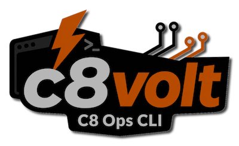

> Generated from build `c8volt v3.6.0-alpha3-29-ga527c6a-dirty`, commit `a527c6a`, built `2026-05-08T10:41:15Z` | Supported Camunda 8 versions: 8.7, 8.8, 8.9



# c8volt Camunda 8 CLI

**Operator-grade Camunda 8 control for people and pipelines. 8.9-ready, script-safe, and built to finish the job.**

> **done is done**
>
> If an action needs retries, waiting, tree traversal, state checks, cleanup, or deterministic machine output before it is truly finished, `c8volt` should do that work for you.

`c8volt` is a Camunda 8 CLI for teams that care about outcomes, not just accepted requests. It is built for operators, developers, support engineers, CI pipelines, and AI agents that need one reliable command line for setup, inspection, recovery, and cleanup.

## Why c8volt

Camunda operations rarely end when an API accepts a request. `c8volt` is shaped around the questions operators ask next:

- Did the process instance actually reach `ACTIVE`?
- Which incident or variable explains the current state?
- What else is in the same process tree?
- Did the cancellation hit the root that really matters?
- Did deletion remove the whole family, not just one visible node?
- Can scripts and agents discover the command contract without scraping help text?
- Can unattended runs fail clearly without hanging on prompts?

That is the gap `c8volt` closes.

## At A Glance

- deploy BPMN and start using it immediately
- run process instances and confirm they become active
- update process-instance-scope variables and confirm visibility
- inspect process trees with incidents and variables in context
- preview, cancel, and delete process-instance families safely
- wait for state or incident conditions in scripts
- search, page, count, and batch process-instance results
- work by profile and tenant on shared clusters
- validate config and test real Camunda connectivity
- discover the public command surface with `capabilities --json`
- run supported commands non-interactively with `--automation`

## Fast Start

From zero to a real Camunda read in a few minutes. Download the matching archive from [c8volt Releases](https://github.com/grafvonb/c8volt/releases), unpack it, then:

```bash
# 1. Install: make sure the unpacked binary runs.
./c8volt version

# 2. Create a config next to the binary.
cp config.example.yaml config.yaml

# 3. Edit only the essentials:
#    app.camunda_version: "8.9"
#    apis.camunda_api.base_url: "http://localhost:8080"
#    auth.mode: "none"
#
#    Use auth.mode: "oauth2" for protected clusters and fill the oauth2 block.
./c8volt config validate

# 4. Test the real connection.
./c8volt config test-connection

# 5. Run the first safe command.
./c8volt get cluster version
```

When `config.yaml` sits next to the `c8volt` executable, it is loaded automatically. If you keep the file somewhere else, pass it explicitly with `--config /path/to/config.yaml`.

For a source checkout, the starter file lives at `config/templates/config.example.yaml`:

```bash
cp config/templates/config.example.yaml config.yaml
```

The smallest local/dev config is this:

```yaml
app:
  camunda_version: "8.9"
apis:
  camunda_api:
    base_url: "http://localhost:8080"
auth:
  mode: "none"
```

Once that works, look around:

```bash
./c8volt get cluster topology
./c8volt get pd --latest
```

Need something runnable in an empty dev cluster? Deploy the bundled BPMN examples:

```bash
./c8volt embed deploy --all --run
```

For scripts or CI, add `--json` when stdout should be data and logs should stay on stderr:

```bash
./c8volt config test-connection --json
```

After the first command, jump to [Configuration Notes](#configuration-notes) for profiles, OAuth, tenants, and precedence.

## Supported Camunda Versions

`c8volt` supports Camunda `8.7`, `8.8`, and `8.9`.

`8.9` is a first-class runtime target. The everyday operator loop is covered: cluster metadata, definitions, resources, process-instance search, wait, walk, run, cancel, delete, tenant handling, and JSON output for automation.

`8.8` remains the established baseline. Process-instance variable updates and job lookup/update commands are supported on Camunda `8.8` and `8.9`; Camunda `8.7` returns an unsupported-version error for those state-changing job and variable update commands. `8.7` remains supported with known upstream limitations where tenant-safe direct keyed process-instance behavior is not available.

## Core Workflows

### Start And Confirm

```bash
./c8volt get pd --latest
./c8volt run pi -b C88_SimpleUserTask_Process
```

By default, `c8volt` waits until the process instance is actually active. If you explicitly want asynchronous behavior:

```bash
./c8volt run pi -b C88_SimpleUserTask_Process --no-wait
```

For batch execution:

```bash
./c8volt run pi -b C88_SimpleUserTask_Process -n 100 --workers 8
```

### Update Runtime Variables

```bash
./c8volt update pi --key 2251799813711967 --vars '{"customerTier":"gold"}'
./c8volt update process-instance --key 2251799813711967 --vars '{"customerTier":"gold"}'
printf '%s\n' 2251799813711967 2251799813711968 | ./c8volt update pi - --vars '{"customerTier":"gold"}'
```

By default, `update pi` submits the variable mutation and waits until the requested process-instance-scope values are visible through the same lookup path used by `get pi --with-vars`. The `--vars` value must be a JSON object; repeated `--key` flags and stdin `-` keys are merged and deduplicated before the same variable map is applied to each target.

Use `--no-wait` when accepted/submitted output is enough:

```bash
./c8volt update pi --key 2251799813711967 --vars '{"customerTier":"gold"}' --no-wait
```

Process-instance variable updates are available on Camunda `8.8` and `8.9`. Camunda `8.7` fails before mutation with an unsupported-version error.

### Inspect And Update Jobs

```bash
./c8volt get job --key 2251799813711967
./c8volt --json get job --key 2251799813711967
./c8volt update job --key 2251799813711967 --retries 3 --dry-run
./c8volt update job --key 2251799813711967 --retries 3 --auto-confirm
./c8volt update job --key 2251799813711967 --timeout 5m --auto-confirm
./c8volt update job --key 2251799813711967 --retries 3 --no-wait --auto-confirm
```

Use `get job` with the `jobKey` from incident-aware process-instance output to inspect the matching runtime job directly. Human job output keeps the full error message by default; use `--error-message-limit` when terminal output should be shortened. `update job` supports retry and timeout changes on Camunda `8.8` and `8.9`; retry changes are confirmed through job lookup by default, while timeout changes report submitted milliseconds without claiming deadline confirmation. Use `--dry-run` to preview the plan without mutation, `--auto-confirm` or `--automation` for unattended mutations, and `--no-wait` when accepted/submitted output is enough.

### Walk Before You Change

```bash
./c8volt walk pi --key 2251799813711967
./c8volt walk pi --key 2251799813711967 --with-incidents
./c8volt walk pi --key 2251799813711967 --with-vars --with-incidents
./c8volt walk pi --key 2251799813711967 --flat
```

Use `walk pi` before a risky action. It shows the process-instance family tree, which is usually where the real cancellation or deletion scope becomes obvious.

For diagnosis, add `--with-incidents` and/or `--with-vars`. Human output stays compact; `--json` gives scripts the full structured details.

### Cancel Safely

Camunda may reject direct cancellation of a child instance when the real action must happen at the root.

```bash
./c8volt cancel pi --key 2251799813711977
./c8volt cancel pi --key 2251799813711977 --dry-run
./c8volt cancel pi --key 2251799813711977 --force
./c8volt cancel pi --state active --start-date-before 2026-03-31
./c8volt cancel pi --state active --start-date-newer-days 30
```

With `--dry-run`, `c8volt` previews the selected process instances, process-instance trees to cancel, process instances in scope, selected instances already in final state, and any partial-scope details without submitting cancellation. With `--force`, `c8volt` escalates from the selected child to the root process instance and waits for the family-level outcome.

### Delete Thoroughly

```bash
./c8volt delete pi --key 2251799813711967 --dry-run
./c8volt delete pi --key 2251799813711967 --force
./c8volt delete pi --state completed --end-date-after 2026-01-01 --end-date-before 2026-01-31 --auto-confirm
./c8volt get pi --state completed --keys-only | ./c8volt delete pi --auto-confirm -
```

Deletion in real environments often means preview the family scope, cancel-first when needed, then remove, then verify. `--dry-run` shows selected instances already in final state and process instances not in final state. Delete is all-or-nothing for the affected scope: if any selected or dependency-expanded process instance is not in a final state, c8volt refuses the whole delete batch before submitting any delete request. Use `--force` when the affected scope must be canceled first and then deleted.

### Wait For A Known State Or Incident

```bash
./c8volt expect pi --key <process-instance-key> --state active
./c8volt expect pi --key <process-instance-key> --incident true
./c8volt expect pi --key <process-instance-key> --state active --incident false
./c8volt expect pi --key <process-instance-key> --state completed --state absent
./c8volt expect pi --key <process-instance-key> --state canceled
./c8volt get pi --key <process-instance-key> --keys-only | ./c8volt expect pi --incident true -
```

`expect` waits for `active`, `completed`, `canceled`, `terminated`, or `absent`; it can also wait for `--incident true|false`, alone or with `--state`. Piped keys work for bulk verification flows.

### Search And Page Process Instances

```bash
./c8volt get pi --state active
./c8volt get pi --state active --total
./c8volt get pi --state active --batch-size 250 --limit 25
./c8volt cancel pi --state active --batch-size 250 --limit 25 --dry-run
./c8volt cancel pi --state active --batch-size 250 --limit 25
./c8volt delete pi --state completed --batch-size 250 --limit 25 --dry-run
./c8volt delete pi --state completed --batch-size 250 --limit 25 --auto-confirm
```

Search-based `get pi`, `cancel pi`, and `delete pi` work page by page instead of silently stopping at the first large result set. Human-oriented modes prompt before continuing unless `--auto-confirm` or `--json` is set. JSON mode consumes remaining pages and returns one aggregated result.

For bulk work, check the batch first, then act:

```bash
./c8volt get pi --bpmn-process-id <bpmn-process-id> --state active --total
./c8volt cancel pi --bpmn-process-id <bpmn-process-id> --state active --dry-run
./c8volt cancel pi --bpmn-process-id <bpmn-process-id> --state active --auto-confirm
```

Use `--batch-size` or `-n` to control how many process instances each backend page may fetch. Use `--limit` or `-l` to cap the total number of matched process instances returned or processed across all pages.

When a script only needs the count of matching process instances, `./c8volt get pi --total` prints only the numeric total. If Camunda reports a capped search total, c8volt keeps paging and counts the matching process instances instead of returning the capped lower bound.

### Resolve From User Task Keys

```bash
./c8volt get pi --has-user-tasks <user-task-key>
./c8volt get pi --has-user-tasks <user-task-key> --has-user-tasks <another-user-task-key>
./c8volt get pi --has-user-tasks <user-task-key> --json
```

`--has-user-tasks` resolves owning process instances through tenant-aware Camunda v2 user-task search first, then renders the process instances through the same keyed path as `get pi --key <process-instance-key>`. Human output, JSON output, `--keys-only`, tenant handling, and process-instance not-found behavior therefore stay aligned with direct keyed lookup.

On Camunda `8.8` and `8.9`, a not-found v2 user-task result falls back to deprecated Tasklist V1 lookup for legacy user-task compatibility. Camunda `8.7` remains unsupported for `--has-user-tasks`, and non-not-found lookup failures are surfaced instead of being retried as fallback misses.

### Pull Exact Artifacts

```bash
./c8volt get pd --key <process-definition-key> --xml
./c8volt get pd --bpmn-process-id C88_SimpleUserTask_Process --latest --stat
./c8volt get resource --id <resource-key>
```

For `get pd --stat`, Camunda `8.8` and `8.9` report process-instance counts for the exact process-definition version: `ac:<count>` for active, `cp:<count>` for completed, `cx:<count>` for canceled, and `inc:<count>` for process instances having at least one incident. Camunda `8.7` rejects statistics because the generated client surface does not provide the same native statistics endpoints.

### Narrow Process Instances

```bash
./c8volt get pi --state active --incidents-only
./c8volt get pi --incidents-only --with-incidents
./c8volt get pi --with-incidents --incident-message-limit 80
./c8volt get pi --key <process-instance-key> --with-incidents
./c8volt get pi --key <process-instance-key> --with-incidents --json
./c8volt get pi --with-vars
./c8volt get pi --key <process-instance-key> --with-vars
./c8volt get pi --key <process-instance-key> --with-vars --with-incidents
./c8volt get pi --key <process-instance-key> --with-vars --var-value-limit 120
./c8volt get pi --key <process-instance-key> --with-vars --json
./c8volt get pi --roots-only
./c8volt get pi --children-only
./c8volt get pi --orphan-children-only
./c8volt get pi --start-date-after 2026-01-01 --start-date-before 2026-01-31
./c8volt get pi --start-date-older-days 7 --start-date-newer-days 30
./c8volt get pi --end-date-before 2026-03-31 --state completed
```

Human process-instance lists mark only incident-bearing instances with `inc!`; instances without incidents omit the incident marker to keep long lists scannable.

Use `--json` when a script needs stable fields and `--keys-only` when piping process-instance keys into another command. Human list output is optimized for scanning; walk output remains tree- or path-oriented.

For incident diagnosis, add `--with-incidents` to keyed or list/search `get pi` output. Direct incident keys and messages appear beneath the matching process-instance row. If the row only tells you there is an incident somewhere in the tree, jump to `walk pi --key <key> --with-incidents`. Add `--incident-message-limit <chars>` for terminal-friendly output; JSON keeps full messages.

When incident output includes `jobKey`, use `get job --key <job-key>` for direct job details. To remediate job retries or timeout, preview with `update job --dry-run`, then submit with `--auto-confirm` or `--automation`; use `--no-wait` when your script will verify later.

For variable inspection, add `--with-vars` to keyed or list/search `get pi` output, or to keyed `walk pi` output. Combine it with `--with-incidents` when you need runtime data and failure context in one view. Human values are full by default; add `--var-value-limit <chars>` for noisy payloads. JSON keeps received values and metadata intact.

The `--start-date-*` and `--end-date-*` flags are inclusive `YYYY-MM-DD` bounds for search/list usage. Relative day filters use `--*-date-older-days N` for `N` days old or older and `--*-date-newer-days N` for `N` days old or newer.

## Configuration Notes

### Precedence

`c8volt` resolves config-backed settings with one shared order:

```text
flag > env > profile > base config > default
```

That applies to root persistent flags such as `--tenant` and `--profile`, command-local config-backed flags, API base URLs, auth mode, and auth credentials/scopes. When `c8volt` cannot determine a safe winner, it fails explicitly instead of guessing.

Use `./c8volt config show` to inspect the effective configuration that a command will use. Prefer `./c8volt config validate` for local validation, `./c8volt config template` for a starter file, and `./c8volt config test-connection` before running changes against a cluster.

### Configuration Flow

Use the setup commands as three small gates:

```bash
# 1. Shape: is config.yaml valid YAML with supported values?
./c8volt config validate

# 2. Effective config: what will c8volt actually use after flags/env/profiles?
./c8volt config show

# 3. Network: can c8volt reach Camunda with that exact config?
./c8volt config test-connection
```

When the network gate succeeds, `config test-connection` reports the selected profile, the tested Camunda base URL, and the cluster gateway version. If the configured Camunda version and gateway version differ by major/minor version, fix the config unless you have a very good reason not to; Camunda APIs can differ between versions.

For automation:

```bash
./c8volt config test-connection --json
```

### Process-Instance Page Size

Search-based `get pi`, `cancel pi`, and `delete pi` use the backend maximum of `1000` when no page size is configured. Set a lower default when you want smaller, steadier batches:

```yaml
app:
  process_instance_page_size: 250
```

`--batch-size` overrides this for one command run. `C8VOLT_APP_PROCESS_INSTANCE_PAGE_SIZE` provides the same setting through the environment.

### Tenant Handling

`c8volt` supports tenant-aware operations through:

- `app.tenant` in the config file
- the global `--tenant` flag for per-command override

Commands that create tenant-owned data, including `deploy pd`, `embed deploy`, `deploy pd --run`, and `run pi`, use Camunda's `<default>` tenant when the effective tenant is empty. Read/search commands preserve an empty tenant as an unscoped visible-tenants query unless `--tenant` is provided.

```yaml
app:
  tenant: "tenant-a"
```

```bash
./c8volt --tenant tenant-a run pi -b C88_SimpleUserTask_Process
./c8volt --tenant tenant-a embed deploy --file processdefinitions/C88_SimpleUserTaskProcess.bpmn
./c8volt --tenant tenant-a get pd --latest
```

### OAuth

Use this pattern when one OAuth token is enough for the operations you run:

```yaml
app:
  camunda_version: "8.9"
apis:
  camunda_api:
    base_url: "https://camunda.example.com"
auth:
  mode: oauth2
  oauth2:
    token_url: "https://login.example.com/oauth/token"
    client_id: "c8volt"
    client_secret: "${set via env}"
log:
  level: info
```

Sensitive values are safer in environment variables than in committed config files:

```bash
export C8VOLT_AUTH_OAUTH2_CLIENT_SECRET='super-secret'
export C8VOLT_AUTH_OAUTH2_CLIENT_ID='c8volt'
./c8volt --profile prod config validate
```

Use profiles when you need to switch environments without copying files:

```yaml
active_profile: local

app:
  camunda_version: "8.9"

profiles:
  local:
    apis:
      camunda_api:
        base_url: "http://localhost:8080"
    auth:
      mode: none

  prod:
    app:
      tenant: "tenant-a"
    apis:
      camunda_api:
        base_url: "https://camunda.example.com"
    auth:
      mode: oauth2
      oauth2:
        token_url: "https://login.example.com/oauth/token"
        client_id: "c8volt"
```

```bash
./c8volt --profile local get cluster topology
./c8volt --profile prod get cluster topology
./c8volt --profile prod get cluster version --with-brokers
```

## Automation And Pipelines

Human-first discovery:

```bash
./c8volt --help
./c8volt get --help
./c8volt run process-instance --help
```

Machine-first discovery:

```bash
./c8volt capabilities --json
```

The discovery document reports public command paths, visible flags, output modes, mutation behavior, contract support, and whether a command explicitly supports `--automation`.
Operational commands that support `--json` return one shared result envelope with `outcome`, `command`, and command-specific `payload` fields.

For supported command paths, combine `--automation` with `--json` when you need deterministic unattended execution and machine-readable stdout:

```bash
./c8volt capabilities --json
./c8volt --automation --json run pi -b C88_SimpleUserTask_Process
./c8volt --automation --json run pi -b C88_SimpleUserTask_Process --no-wait
./c8volt --automation --json update pi --key <process-instance-key> --vars '{"customerTier":"gold"}' --no-wait
./c8volt --automation --json update job --key <job-key> --retries 3 --auto-confirm
./c8volt --automation --json get pi --bpmn-process-id C88_SimpleUserTask_Process --state active
```

Useful pipeline controls:

- `--json` for structured output
- `--keys-only` for command chaining
- `--automation` for non-interactive mode on supported commands
- `--auto-confirm` for bulk flows that should continue without repeated prompts
- `--workers` for controlled concurrency
- `--fail-fast` when one error should stop the next wave of work
- `--timeout` for per-invocation HTTP request timeout control
- `--quiet` and `--verbose` for different execution contexts
- `--profile` and `--config` for environment switching

Examples:

```bash
./c8volt get pi --key <process-instance-key> --keys-only | ./c8volt cancel pi --auto-confirm --no-wait -
./c8volt get pi --state active --keys-only | ./c8volt update pi - --vars '{"priority":"high"}' --no-wait
./c8volt get job --key <job-key>
./c8volt update job --key <job-key> --retries 3 --dry-run
./c8volt update job --key <job-key> --retries 3 --no-wait --auto-confirm
./c8volt get pd --bpmn-process-id C88_SimpleUserTask_Process --latest --keys-only | ./c8volt delete pd --allow-inconsistent --auto-confirm --no-wait -
```

## Command Map

```text
c8volt
|-- embed                     Work with bundled BPMN fixtures
|   |-- list                  List bundled BPMN assets
|   |-- deploy                Deploy bundled fixtures
|   `-- export                Export bundled fixtures
|-- deploy                    Deploy resources from files or stdin
|   `-- pd                    Deploy BPMN process definitions
|-- run                       Start runnable resources
|   `-- pi                    Start process instances and confirm activation by default
|-- update                    Update existing resources
|   |-- pi                    Update process-instance variables and confirm visibility by default
|   `-- job                   Update job retries and timeout by key
|-- walk                      Inspect parent/child relationships
|   `-- pi                    Walk ancestors, descendants, or full family trees
|-- cancel                    Cancel resources and wait for confirmation
|   `-- pi                    Cancel process instances, including root escalation with --force
|-- delete                    Delete resources, optionally forcing cleanup first
|   |-- pi                    Delete process instance trees
|   `-- pd                    Delete process definitions with safety warnings
|-- expect                    Wait until resources reach a target state
|   `-- pi                    Wait for state or incident conditions
|-- get                       Read state, metadata, and resources
|   |-- cluster topology      Show connected Camunda cluster topology as a tree
|   |-- cluster version       Show gateway and optional broker versions
|   |-- cluster license       Show cluster license details
|   |-- process-definition    List definitions, fetch latest versions, or retrieve XML
|   |-- process-instance      List, fetch, and enrich process instances
|   |-- job                   Inspect a job by key
|   |-- tenant                List, filter, or fetch visible tenants
|   `-- resource              Fetch a single resource by id
|-- capabilities              Describe the public CLI contract for automation and discovery
|-- completion                Generate shell completion scripts
|-- config                    Inspect and validate c8volt configuration
|   |-- show                  Show effective configuration
|   |-- validate              Validate effective configuration
|   |-- template              Print a blank configuration template
|   `-- test-connection       Test configured Camunda connection
`-- version                   Print build and compatibility information
```

## Everyday Commands

These are the commands most teams reach for during normal development,
support, and operations loops: deploy something, start it, find the affected
instances, inspect the tree, wait for the outcome, and clean up safely.

```bash
# Deploy or redeploy BPMN, then verify the latest definition Camunda sees.
./c8volt deploy pd --file <process.bpmn>
./c8volt deploy pd --file <process.bpmn> --run
./c8volt get pd --bpmn-process-id <bpmn-process-id> --latest --stat

# Local fixture loop for quick smoke tests.
./c8volt embed deploy --file processdefinitions/C88_SimpleUserTaskProcess.bpmn --run

# Start process instances from the latest version.
./c8volt run pi -b <bpmn-process-id> --vars '{"customerId":"1234"}'
./c8volt run pi -b <bpmn-process-id> -n 25 --workers 5

# Update process-instance-scope variables.
./c8volt update pi --key <process-instance-key> --vars '{"customerTier":"gold"}'
./c8volt get pi --state active --keys-only | ./c8volt update pi - --vars '{"priority":"high"}' --no-wait

# Inspect and update jobs from incident job keys.
./c8volt get job --key <job-key>
./c8volt update job --key <job-key> --retries 3 --dry-run
./c8volt update job --key <job-key> --timeout 5m --auto-confirm
./c8volt update job --key <job-key> --retries 3 --no-wait --auto-confirm

# Find active work, incidents, and exact instance details.
./c8volt get pi --bpmn-process-id <bpmn-process-id> --state active
./c8volt --automation --json get pi --bpmn-process-id <bpmn-process-id> --state active
./c8volt get pi --state active --incidents-only
./c8volt get pi --key <process-instance-key> --with-incidents
./c8volt get pi --state active --with-vars
./c8volt get pi --key <process-instance-key> --with-vars --with-incidents
./c8volt get pi --state active --total

# Inspect parent/child relationships before taking action.
./c8volt walk pi --key <process-instance-key>
./c8volt walk pi --key <process-instance-key> --with-incidents
./c8volt walk pi --key <process-instance-key> --with-vars --with-incidents
./c8volt walk pi --key <process-instance-key> --flat

# Wait for automation-visible outcomes.
./c8volt expect pi --key <process-instance-key> --state active
./c8volt expect pi --key <process-instance-key> --incident true
./c8volt expect pi --key <process-instance-key> --state active --incident false
./c8volt expect pi --key <process-instance-key> --state completed --state absent

# Preview and perform cancellation.
./c8volt cancel pi --key <process-instance-key> --dry-run
./c8volt cancel pi --key <process-instance-key> --force
./c8volt get pi --state active --keys-only | ./c8volt cancel pi --auto-confirm --no-wait -

# Preview and perform cleanup of completed instances.
./c8volt delete pi --state completed --end-date-older-days 7 --limit 25 --dry-run
./c8volt delete pi --state completed --end-date-older-days 7 --auto-confirm
./c8volt expect pi --key <process-instance-key> --state absent
```

## Documentation

- Project site: [c8volt.info](https://c8volt.info)
- Generated CLI reference: [c8volt.info/cli](https://c8volt.info/cli/)
- Releases: [github.com/grafvonb/c8volt/releases](https://github.com/grafvonb/c8volt/releases)

## Project Governance

- License and copyright: [LICENSE](https://github.com/grafvonb/c8volt/blob/main/LICENSE), [COPYRIGHT](https://github.com/grafvonb/c8volt/blob/main/COPYRIGHT), and [NOTICE.md](https://github.com/grafvonb/c8volt/blob/main/NOTICE.md)
- Trademark policy: [TRADEMARKS.md](https://github.com/grafvonb/c8volt/blob/main/TRADEMARKS.md)
- Contributing and DCO sign-off: [CONTRIBUTING.md](https://github.com/grafvonb/c8volt/blob/main/CONTRIBUTING.md)
- Security reporting: [SECURITY.md](https://github.com/grafvonb/c8volt/blob/main/SECURITY.md)

## Copyright

(c) 2026 Adam Bogdan Boczek | <a href="https://boczek.info" target="_blank" rel="noopener noreferrer">boczek.info</a>
